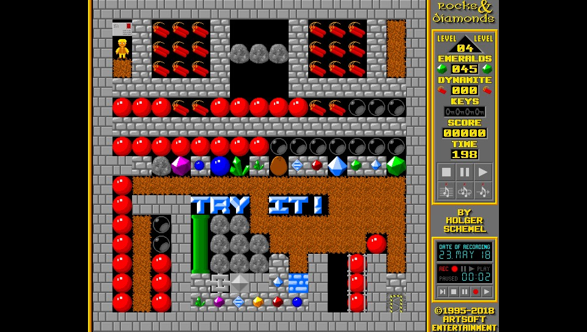

Recent Changes
======
1.11 (Switch only)

- On Switch, implement on-screen keyboard (only works when launching with nsp injection)

Description
======
These are my Vita and Switch ports of Rocks'n'Diamonds and Mirrormagic. 

**Rocks'n'Diamonds** is a Boulderdash type game by Holger Schemel with many unique features, such as the ability to play remade levels from Boulderdash, Emerald Mine and Supaplex and many more levels.



**Mirrormagic** is a game by Holger Schemel in the tradition of Deflektor and Mindbender. You guide a laser beam by adjusting mirrors before the time limit runs out.


More information about the games can be found at the homepages for the Windows versions:

http://www.artsoft.org/2018/04/10/1-rocksndiamonds-4-1-0-0-released/
http://www.artsoft.org/mirrormagic

And the official manual for Rocks'n'Diamonds is here:

https://www.artsoft.org/rocksndiamonds/manual/index.html

Thanks
======
Thanks to my awesome supporters on Patreon, especially Andyways, CountDuckula, Matthew Machnee, and Sean Ritzo.

Thanks @FrangarCJ for help with optimizing the rendering. 

Thanks to Holger Schemel for making a great and portable game.

Thanks to the many devs of VitaSDK for a great development environment.

Thanks to all the devs of DevKitPro for Switch for a great development suite. 

Installation (Vita)
=====

- install the vpks

- extract contents of `rocksndiamonds_data.zip` and `mirrormagic_data.zip` and copy them to your Vita's `ux0:/data` folder. You should have folders `ux0:/data/rocksndiamonds` and `ux0:/data/mirrormagic` on your Vita with the files in them.  

Installation (Switch)
=====

- extract `rocksndiamonds_data.zip` and `mirrormagic_data.zip` to the folder `switch/` in the root of your sd card. You should have folders such as `switch/rocksndiamonds/levels` and `switch/mirrormagic/levels` and more. Make sure none of the folders or files has the "archive" flag set after copying.
 
- copy `rocksndiamonds.nro` to `switch/rocksndiamonds/` and `mirrormagic.nro` to `switch/mirrormagic/`

- use hblauncher or any other method of choice to start the games.

Vita/Switch-Exclusive Features
=======
- game controller mapping including analog joystick mouse controls
- front touch controls with left/right mouse click and drag and drop gestures
- the game runs smooth at the same speed as the desktop versions
- additional level package with thousands of levels as separate download (see 'More Levels')
- auto-hide mouse cursor when using the dpad
- easily switch player focus in multiplayer games using r+triangle and r+square
- 60 fps mode for smooth scrolling and motion in levels where the system can achieve stable 60 frames per second.
- text entry with Vita/Switch touch keyboard, no physical keyboard or mouse required

Vita-Exclusive Features
========
- support for bluetooth keyboard and mouse

Gamepad Controls (Vita)
======
Dpad or left stick = move player and navigate menus  
right stick = move mouse pointer  
Cross = primary button (+ direction for snap action or turning mirrors, also 'ok' in menu)  
Circle = secondary button (drop dynamite)  
Square / L = left mouse button  
Triangle / R = right mouse button  
Select = quit (escape key, also cancels requesters)  
Start = pause (space key)  
R+Triangle = set focus to next player (ALL->1->2->3->4)  
R+Square = set player focus to previous player (ALL<-1<-2<-3<-4)  

Gamepad Controls (Switch)
======
Dpad or left stick = move player and navigate menus  
right stick = move mouse pointer  
B = primary button (+ direction for snap action or turning mirrors, also 'ok' in menu)  
A = secondary button (drop dynamite)  
Y or L = left mouse button  
X or R = right mouse button  
Minus = quit (escape key, also cancels requesters)  
Plus = pause (space key)  
R+X = set focus to next player (ALL->1->2->3->4)  
R+Y = set player focus to previous player (ALL<-1<-2<-3<-4)  

Touch Controls
=======
Note: for multi-touch gestures, the fingers have to be far enough apart from each other, so that the Vita will not erroneously recognize them as a single finger. Otherwise the pointer will jump around.

Single short tap = left mouse click  
Single short tap while holding a second finger down = right mouse click  
Single finger drag = move the mouse pointer  
Dual finger drag = drag'n'drop (left mouse button is held down)  
Three finger drag = drag'n'drop (right mouse button is held down)  

More Levels for Rocks'n'Diamonds
=========

- More than 50,000 additional Rocks'n'Diamonds levels can be downloaded here: http://www.artsoft.org/rocksndiamonds/levels/

- I made a single easy-to-install zip [More_Levels_v2.zip](https://mega.nz/#!tdBhDRrZ!t4XrrCyXzCSGjcgFjvh-Sm1MhGErcsWg3UOjUZCKvZ4) (~80 MB). It contains selected additional levels from the above site and is available here:
https://mega.nz/#!tdBhDRrZ!t4XrrCyXzCSGjcgFjvh-Sm1MhGErcsWg3UOjUZCKvZ4

- Just download, unzip, and  transfer to your Vita, so that you have a subfolder `ux0:/data/rocksndiamonds/levels/More_Levels`. Or transfer to your Switch, so that you have a subfolder `switch/rocksndiamonds/levels/More_Levels`.

- FTP transfer of levelsets has to be done using binary transfer mode, not Auto or ASCII . Otherwise some levels will be treated as ASCII with mangled line endings and won't work. This was verified with the Emerald_Mine_Club_original_1 levels and FileZilla FTP.

Notes
=====
- It is possible to get a wrong screen size on Switch by messing with the options. The solution is to navigate to setup->graphics and enable Fullscreen mode and set Window size to 100%, then select "save & exit"

- To load new level sets, go to the level number selection in the menu, and press X (B on Switch). A new screen should open that shows a few levels. Go to the parent dir and into the folder Classic Games. There are many more levels already included in that folder.

- Sometimes when loading a levelset after loading other level sets one after the other, the game runs out of memory and quits. This is fixed by simply restarting the game and loading the levelset again.

- To answer the OK/Cancel dialogs in the game, press select (minus on Switch) to cancel (this is escape), or X (B on Switch) for OK.

- You can install new level sets for Rocks'n'Diamonds by copying them into ux0:/data/rocksndiamonds/levels on Vita, or /switch/rocksndiamonds/levels on Switch. See the official manual: https://www.artsoft.org/rocksndiamonds/manual/manual.html#

- Similarly, you can install new level sets for Mirrormagic by copying them into ux0:/data/mirrormagic/levels on Vita, and /switch/mirrormagic/levels on Switch. 

- If you mess up some options and want to reset to default, you can delete the folder 'ux0:/data/rocksndiamonds/userdata' and/or 'ux0:/data/mirrormagic/userdata'. On Switch, the folders are '/switch/rocksndiamonds/userdata' and '/switch/mirrormagic/userdata'.

- For multiplayer team mode in Rocks'n'Diamonds, enable it via Setup->Game & Menu->Team-Mode (Multiplayer)->on. You also have to find make a level that has multiple players. R+Square and R+Triangle (R+Y and R+X on Switch) can be used in-game to change focus between players, see Game Controls. All controllers have to be paired before launching the app, otherwise they will not be recognized by the game.

Build Instructions
=====
- clone the repository, then
````
cd rocksndiamonds
````
Then use
````
make vitarocks
````
or
````
make switchrocks
````
for Rocks'n'Diamonds, and
````
make vitamirror
````
or
````
make switchmirror
````
for Mirrormagic.

You need the latest SDL2 Vita library from 05-23-2018 or later for this to work. The latest SDL2 library can be downloaded by updating your vitasdk, or here: https://dl.vitasdk.org

CHANGELOG
=====
1.11 (Switch only)

- On Switch, implement on-screen keyboard (only works when launching with nsp injection)

1.10 (Switch only)

- fixed problem on Switch with too-large screen in docked mode when loading saved config. The workaround was to change window size to 100% and save again. Now Fullscreen mode should be set to "On" and then this problem does not appear anymore.

1.9switch

- added Switch port

1.9

- add '60 fps' game speed setting for perfectly smooth motion in some levels on the Vita. It works well with the bundled Emerald Mine levelsets. This mode is 20% faster than the default setting 'normal.'

- removed slow-down when playing levelsets that use the Emerald Mine engine with default graphics.

1.8

- map set player focus to r+triangle and r+square for multiplayer games on VitaTV (up to 4 players)

1.7

- enabled mp3 music support, used by some custom levelsets

1.6

- support editing multiline textfields in level editor

1.5

- optimized rendering for large speed improvement (1.5x), noticable mostly on the very fast game speed setting (thanks @FrangarCJ for the help).
- fixed sticky touch inputs and other issues with touch controls

1.4

- fixed screen centering
- fixed screen scaling so it works for all sizes

1.3

- Mirrormagic as separate app. It uses the same codebase as Rocks'n'Diamonds.
- Smoother mouse pointer motion.

1.2

- Significant speedup by drawing directly to texture pixels. Setting game speed to 'very fast' actually makes it faster now.

1.1

- implemented mouse pointer controls via right analog stick and front touch. The level editor is fully usable now.
- improved picture quality for sharper graphics

1.0

- fixed name entry using touch keyboard. It works without any return or backspace keypresses now.
- fixed graphics corruption of some cartoons on menu screen (updated data.zip)

0.9

- initial Vita release